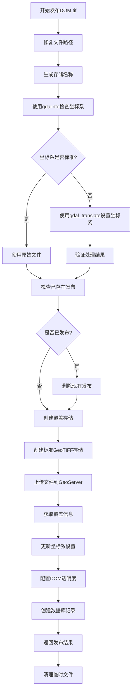

# DOM.tif文件发布功能说明

## 🎯 功能概述

新增的 `publish_dom_geotiff` 方法专门用于发布DOM.tif文件，具有以下特性：

1. **智能坐标系检查**: 使用 `gdalinfo` 命令检查文件坐标系信息
2. **自动坐标系修复**: 如果坐标系不是标准EPSG，使用 `gdal_translate` 自动设置
3. **标准GeoTIFF发布**: 使用标准GeoTIFF方式发布（不使用ImageMosaic）
4. **透明度自动配置**: 自动设置黑色背景为透明（Input Transparent Color: 000000）

## 🔧 核心功能

### 1. 坐标系智能检查 (`_check_coordinate_system_with_gdalinfo`)

```python
# 使用gdalinfo检查坐标系信息
gdalinfo_result = self._check_coordinate_system_with_gdalinfo(tif_path)

# 返回结果包含：
{
    'srs': 'EPSG:2343',           # 坐标系代码
    'needs_fix': False,           # 是否需要修复
    'proj_name': 'Transverse_Mercator',  # 投影类型
    'central_meridian': 106.5,    # 中央经线
    'datum': 'CGCS2000',         # 基准面
    'ellipsoid': 'GRS80'         # 椭球体
}
```

### 2. 坐标系自动推断 (`_determine_target_epsg`)

根据投影参数自动推断目标EPSG坐标系：

- **中央经线 106.5°** → `EPSG:2343` (CGCS2000 / 3-degree Gauss-Kruger CM 106.5E)
- **其他CGCS2000坐标系** → 可扩展支持更多坐标系

### 3. GDAL坐标系处理 (`_process_tif_with_gdal_translate`)

```bash
# 执行的GDAL命令示例
gdal_translate -a_srs EPSG:2343 input.tif output.tif
```

### 4. DOM透明度配置 (`_configure_dom_transparency`)

专门为DOM文件设置透明度参数：

```xml
<coverage>
    <parameters>
        <entry>
            <string>InputTransparentColor</string>
            <string>#000000</string>
        </entry>
        <entry>
            <string>OutputTransparentColor</string>
            <string>#000000</string>
        </entry>
        <entry>
            <string>BackgroundValues</string>
            <string>0</string>
        </entry>
    </parameters>
</coverage>
```

## 📝 使用方法

### 基本用法

```python
from services.geoserver_service import GeoServerService

# 初始化服务
geoserver = GeoServerService()

# 发布DOM.tif文件
result = geoserver.publish_dom_geotiff(
    tif_path="path/to/dom.tif",
    store_name="dom_store",  # 会被自动重新生成
    file_id="file_001",
    force_epsg="EPSG:2343"   # 可选：强制设置坐标系
)
```

### 参数说明

| 参数 | 类型 | 必填 | 说明 |
|------|------|------|------|
| `tif_path` | str | ✅ | DOM.tif文件路径 |
| `store_name` | str | ✅ | 数据存储名称（会被重新生成为"文件名_store"格式） |
| `file_id` | str | ✅ | 文件ID |
| `force_epsg` | str | ❌ | 强制设置的EPSG坐标系，如'EPSG:2343' |

### 返回结果

```python
{
    "success": True,
    "store_name": "dom_file_store",
    "layer_name": "shpservice:dom_file_store",
    "wms_url": "http://localhost:8083/geoserver/shpservice/wms",
    "layer_info": {...},
    "filename": "dom_file",
    "coordinate_system": "EPSG:2343",
    "transparency_enabled": True,
    "processed_with_gdal": True,
    "original_srs": "unnamed_ellipse_Transverse_Mercator"
}
```

## 🔄 发布流程



## 🧪 测试方法

运行测试脚本：

```bash
cd backend
python test_dom_publish.py
```

测试脚本会执行：

1. **坐标系检查测试**: 验证gdalinfo功能
2. **DOM发布测试**: 完整的发布流程测试

## 🔍 故障排除

### 常见问题

1. **gdalinfo命令未找到**
   ```
   解决方案: 确保GDAL已正确安装并添加到PATH环境变量
   ```

2. **坐标系设置失败**
   ```
   解决方案: 检查force_epsg参数格式，确保为"EPSG:xxxx"格式
   ```

3. **透明度设置失败**
   ```
   解决方案: 检查GeoServer版本和REST API兼容性
   ```

4. **文件上传失败**
   ```
   解决方案: 检查文件路径、权限和GeoServer连接状态
   ```

### 调试信息

发布过程中会输出详细的调试信息：

```
🎯 开始发布DOM.tif文件: /path/to/file.tif
📋 使用gdalinfo检查文件坐标系信息...
🔍 执行gdalinfo检查坐标系: /path/to/file.tif
🗺️ 坐标系信息:
  PROJCRS["unnamed_ellipse_Transverse_Mercator"...
⚠️ 检测到未命名/未知坐标系，需要修复
🧭 中央经线: 106.5°
📐 投影类型: 横轴墨卡托投影
🔧 需要设置坐标系为: EPSG:2343
🚀 执行命令: gdal_translate -a_srs EPSG:2343 input.tif output.tif
✅ gdal_translate处理成功
📁 使用标准GeoTIFF方式创建coveragestore
📤 上传GeoTIFF文件到GeoServer...
🗺️ 更新坐标系为: EPSG:2343
🎨 配置DOM文件透明度设置 (Input Transparent Color: 000000)
✅ DOM.tif发布成功！
```

## 🆚 与原方法的区别

| 特性 | 原 `publish_geotiff` | 新 `publish_dom_geotiff` |
|------|---------------------|-------------------------|
| 坐标系检查 | 无 | ✅ 使用gdalinfo检查 |
| 坐标系修复 | 无 | ✅ 使用gdal_translate修复 |
| ImageMosaic | ✅ 支持 | ❌ 已移除 |
| 透明度设置 | 通用设置 | ✅ DOM专用设置 |
| 错误处理 | 基础 | ✅ 增强错误处理 |
| 调试信息 | 基础 | ✅ 详细调试信息 |

## 📋 依赖要求

- **GDAL**: 用于坐标系检查和处理
- **GeoServer**: 2.15+ 版本
- **Python**: 3.6+ 版本
- **数据库**: PostgreSQL (用于存储发布记录)

## 🎉 总结

新的 `publish_dom_geotiff` 方法专门针对DOM.tif文件的特殊需求进行了优化，提供了：

- ✅ 智能坐标系处理
- ✅ 自动透明度配置  
- ✅ 标准GeoTIFF发布
- ✅ 详细错误处理
- ✅ 完整的调试信息

这个方法解决了您遇到的CGCS2000坐标系识别问题，并确保DOM文件的黑色背景正确设置为透明。 