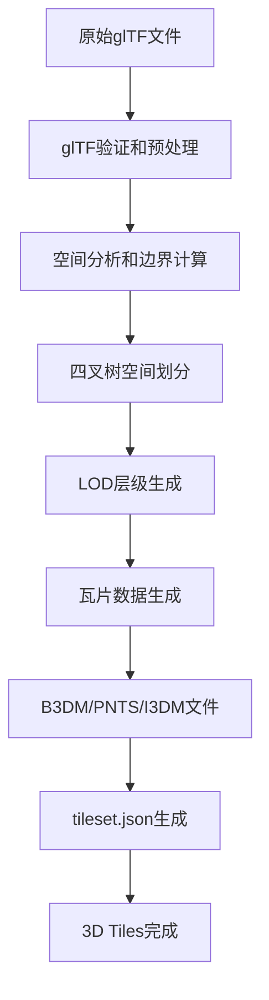

# BIMserver使用说明 & glTF转3D Tiles详解

## 1. BIMserver在您项目中的使用可行性

### 1.1 许可证分析

**BIMserver采用Affero GPL (AGPL)许可证**，这对您的项目有以下影响：

#### ✅ 可以使用的情况：
- **开源项目**：如果您的整个项目是开源的，可以自由使用
- **内部使用**：企业内部使用不分发给第三方，可以使用
- **SaaS服务**：由于AGPL的网络服务条款，如果作为网络服务提供，需要开源

#### ⚠️ 需要注意的情况：
- **商业闭源产品**：如果要集成到闭源商业产品中分发，需要将整个项目开源
- **API调用**：通过API调用BIMserver服务相对安全，不直接集成代码

### 1.2 推荐的使用方式

```
方案一：API调用方式（推荐）
您的后端 → HTTP API → BIMserver服务 → IFC处理结果

方案二：开源替代方案
使用 IFCOpenShell（LGPL许可证）更友好
```

### 1.3 IFCOpenShell作为更好的选择

```python
# IFCOpenShell使用示例 - LGPL许可证，更适合商业项目
import ifcopenshell
import ifcopenshell.geom

# 加载IFC文件
ifc_file = ifcopenshell.open('model.ifc')

# 提取几何信息
settings = ifcopenshell.geom.settings()
iterator = ifcopenshell.geom.iterator(settings, ifc_file)

# 转换为几何数据
geometries = []
for item in iterator:
    shape = iterator.get()
    mesh = shape.geometry
    # 处理网格数据...
```

## 2. glTF转3D Tiles详细流程

### 2.1 整体转换流程



### 2.2 技术实现方案

#### 2.2.1 使用Cesium官方工具

```bash
# 安装3d-tiles-tools
npm install -g 3d-tiles-tools

# 方法1：直接转换单个glTF为B3DM
npx 3d-tiles-tools glbToB3dm -i model.glb -o model.b3dm

# 方法2：从目录创建完整tileset
npx 3d-tiles-tools createTilesetJson -i ./gltf_files/ -o ./output/tileset.json
```

#### 2.2.2 使用Python实现

```python
import json
import struct
import numpy as np
from pathlib import Path

class GLTFTo3DTiles:
    def __init__(self):
        self.tileset = {
            "asset": {"version": "1.0"},
            "geometricError": 500,
            "root": {}
        }
    
    def convert_gltf_to_b3dm(self, gltf_path, output_path):
        """将glTF转换为B3DM"""
        # 1. 读取glTF文件
        with open(gltf_path, 'rb') as f:
            gltf_data = f.read()
        
        # 2. 创建空的feature table和batch table
        feature_table = {}
        batch_table = {}
        
        # 3. 序列化表格
        ft_json = json.dumps(feature_table).encode('utf-8')
        bt_json = json.dumps(batch_table).encode('utf-8')
        
        # 4. 计算padding
        ft_padding = self._get_padding(len(ft_json))
        bt_padding = self._get_padding(len(bt_json))
        
        # 5. 构建B3DM头部
        header = struct.pack('<4s7I',
            b'b3dm',                    # magic
            1,                          # version
            28 + len(ft_json) + ft_padding + len(bt_json) + bt_padding + len(gltf_data),  # byteLength
            len(ft_json),               # featureTableJSONByteLength
            0,                          # featureTableBinaryByteLength
            len(bt_json),               # batchTableJSONByteLength
            0                           # batchTableBinaryByteLength
        )
        
        # 6. 写入B3DM文件
        with open(output_path, 'wb') as f:
            f.write(header)
            f.write(ft_json)
            f.write(b'\x00' * ft_padding)
            f.write(bt_json)
            f.write(b'\x00' * bt_padding)
            f.write(gltf_data)
    
    def _get_padding(self, byte_length):
        """计算8字节对齐的padding"""
        remainder = byte_length % 8
        return (8 - remainder) % 8
    
    def create_tileset_json(self, bounds, gltf_files, output_dir):
        """创建tileset.json"""
        # 计算几何误差和变换矩阵
        geometric_error = self._calculate_geometric_error(bounds)
        transform = self._calculate_transform(bounds)
        
        # 创建根瓦片
        root_tile = {
            "boundingVolume": {
                "region": bounds  # [west, south, east, north, min_height, max_height]
            },
            "geometricError": geometric_error,
            "content": {"uri": "model.b3dm"},
            "children": []
        }
        
        self.tileset["root"] = root_tile
        
        # 写入tileset.json
        tileset_path = Path(output_dir) / "tileset.json"
        with open(tileset_path, 'w') as f:
            json.dump(self.tileset, f, indent=2)
    
    def _calculate_geometric_error(self, bounds):
        """计算几何误差"""
        # 基于边界框大小计算适当的几何误差
        width = bounds[2] - bounds[0]  # east - west
        height = bounds[3] - bounds[1]  # north - south
        return max(width, height) * 111319.9  # 度转米的近似值
    
    def _calculate_transform(self, bounds):
        """计算变换矩阵"""
        # 简化版本，实际应用中需要更复杂的地理坐标转换
        center_lon = (bounds[0] + bounds[2]) / 2
        center_lat = (bounds[1] + bounds[3]) / 2
        center_height = (bounds[4] + bounds[5]) / 2
        
        # 返回4x4变换矩阵（这里是简化版本）
        return [
            1, 0, 0, 0,
            0, 1, 0, 0,
            0, 0, 1, 0,
            center_lon, center_lat, center_height, 1
        ]

# 使用示例
converter = GLTFTo3DTiles()

# 转换单个文件
converter.convert_gltf_to_b3dm('model.glb', 'model.b3dm')

# 创建tileset
bounds = [-74.0, 40.7, -73.9, 40.8, 0, 100]  # NYC区域示例
converter.create_tileset_json(bounds, ['model.glb'], './output/')
```

#### 2.2.3 使用JavaScript/Node.js实现

```javascript
const fs = require('fs');
const path = require('path');

class GLTFTo3DTilesConverter {
    constructor() {
        this.magicB3DM = Buffer.from('b3dm');
        this.version = 1;
    }
    
    async convertGLTFToB3DM(gltfPath, outputPath) {
        // 读取glTF文件
        const gltfBuffer = fs.readFileSync(gltfPath);
        
        // 创建空的Feature Table和Batch Table
        const featureTable = {};
        const batchTable = {};
        
        // 序列化JSON
        const featureTableJSON = Buffer.from(JSON.stringify(featureTable));
        const batchTableJSON = Buffer.from(JSON.stringify(batchTable));
        
        // 计算padding（8字节对齐）
        const featureTablePadding = this.getPadding(featureTableJSON.length);
        const batchTablePadding = this.getPadding(batchTableJSON.length);
        
        // 计算总长度
        const headerLength = 28;
        const totalLength = headerLength + 
                           featureTableJSON.length + featureTablePadding +
                           batchTableJSON.length + batchTablePadding +
                           gltfBuffer.length;
        
        // 创建头部
        const header = Buffer.alloc(headerLength);
        let offset = 0;
        
        this.magicB3DM.copy(header, offset); offset += 4;
        header.writeUInt32LE(this.version, offset); offset += 4;
        header.writeUInt32LE(totalLength, offset); offset += 4;
        header.writeUInt32LE(featureTableJSON.length, offset); offset += 4;
        header.writeUInt32LE(0, offset); offset += 4; // featureTableBinaryByteLength
        header.writeUInt32LE(batchTableJSON.length, offset); offset += 4;
        header.writeUInt32LE(0, offset); // batchTableBinaryByteLength
        
        // 组合所有部分
        const paddingBuffer1 = Buffer.alloc(featureTablePadding);
        const paddingBuffer2 = Buffer.alloc(batchTablePadding);
        
        const b3dmBuffer = Buffer.concat([
            header,
            featureTableJSON,
            paddingBuffer1,
            batchTableJSON,
            paddingBuffer2,
            gltfBuffer
        ]);
        
        // 写入文件
        fs.writeFileSync(outputPath, b3dmBuffer);
        console.log(`B3DM文件创建成功: ${outputPath}`);
    }
    
    getPadding(byteLength) {
        const remainder = byteLength % 8;
        return remainder === 0 ? 0 : 8 - remainder;
    }
    
    createTilesetJSON(options) {
        const { bounds, contentUri, outputPath, geometricError = 500 } = options;
        
        const tileset = {
            asset: {
                version: "1.0"
            },
            geometricError: geometricError,
            root: {
                boundingVolume: {
                    region: bounds // [west, south, east, north, min_height, max_height]
                },
                geometricError: geometricError / 2,
                content: {
                    uri: contentUri
                }
            }
        };
        
        fs.writeFileSync(outputPath, JSON.stringify(tileset, null, 2));
        console.log(`Tileset JSON创建成功: ${outputPath}`);
    }
}

// 使用示例
async function main() {
    const converter = new GLTFTo3DTilesConverter();
    
    // 转换glTF为B3DM
    await converter.convertGLTFToB3DM('./input/model.glb', './output/model.b3dm');
    
    // 创建tileset.json
    const bounds = [-1.31968, 0.98347, -1.31966, 0.98349, 0, 100]; // 弧度制
    converter.createTilesetJSON({
        bounds: bounds,
        contentUri: 'model.b3dm',
        outputPath: './output/tileset.json',
        geometricError: 200
    });
}

main().catch(console.error);
```

### 2.3 高级功能实现

#### 2.3.1 自动LOD生成

```python
import numpy as np
from scipy.spatial import cKDTree

def generate_lod_levels(vertices, faces, target_face_counts):
    """生成多级LOD"""
    lod_levels = []
    
    for target_count in target_face_counts:
        # 使用简化算法（这里是伪代码，实际需要用mesh简化库）
        simplified_vertices, simplified_faces = simplify_mesh(
            vertices, faces, target_count
        )
        lod_levels.append({
            'vertices': simplified_vertices,
            'faces': simplified_faces,
            'face_count': len(simplified_faces)
        })
    
    return lod_levels

def simplify_mesh(vertices, faces, target_face_count):
    """网格简化（需要使用专业库如Open3D）"""
    # 这里需要集成Open3D或其他网格简化库
    pass
```

#### 2.3.2 四叉树空间划分

```python
class QuadTree:
    def __init__(self, bounds, max_depth=10, max_objects=100):
        self.bounds = bounds  # [min_x, min_y, max_x, max_y]
        self.max_depth = max_depth
        self.max_objects = max_objects
        self.objects = []
        self.children = []
        self.depth = 0
    
    def subdivide(self):
        """细分四叉树节点"""
        x, y, w, h = self.bounds
        half_w, half_h = w / 2, h / 2
        
        # 创建四个子节点
        self.children = [
            QuadTree([x, y, half_w, half_h], self.max_depth, self.max_objects),          # 左上
            QuadTree([x + half_w, y, half_w, half_h], self.max_depth, self.max_objects), # 右上
            QuadTree([x, y + half_h, half_w, half_h], self.max_depth, self.max_objects), # 左下
            QuadTree([x + half_w, y + half_h, half_w, half_h], self.max_depth, self.max_objects) # 右下
        ]
    
    def insert(self, obj):
        """插入对象到四叉树"""
        if len(self.children) > 0:
            # 已经细分，插入到子节点
            for child in self.children:
                if child.contains(obj):
                    child.insert(obj)
                    return
        
        self.objects.append(obj)
        
        # 检查是否需要细分
        if (len(self.objects) > self.max_objects and 
            self.depth < self.max_depth and 
            len(self.children) == 0):
            self.subdivide()
            
            # 重新分配对象到子节点
            for obj in self.objects:
                for child in self.children:
                    if child.contains(obj):
                        child.insert(obj)
                        break
            self.objects = []
    
    def to_3d_tiles(self):
        """转换为3D Tiles结构"""
        tile = {
            "boundingVolume": {
                "region": self.bounds_to_region()
            },
            "geometricError": self.calculate_geometric_error(),
            "children": []
        }
        
        if len(self.children) > 0:
            for child in self.children:
                if len(child.objects) > 0 or len(child.children) > 0:
                    tile["children"].append(child.to_3d_tiles())
        else:
            # 叶子节点，包含实际内容
            tile["content"] = {
                "uri": f"tile_{hash(str(self.bounds))}.b3dm"
            }
        
        return tile
```

### 2.4 性能优化建议

#### 2.4.1 文件压缩
```bash
# 使用Draco压缩
gltf-pipeline -i model.gltf -o compressed.glb --draco.compressMeshes

# 使用WebP纹理
# 在转换过程中自动转换纹理格式
```

#### 2.4.2 瓦片优化
```python
def optimize_tile_size(vertices, target_size_mb=1):
    """优化瓦片大小"""
    estimated_size = estimate_tile_size(vertices)
    
    if estimated_size > target_size_mb:
        # 细分瓦片
        return subdivide_tile(vertices)
    else:
        return [vertices]

def estimate_tile_size(vertices):
    """估算瓦片文件大小"""
    vertex_count = len(vertices)
    # 粗略估算：每个顶点约32字节，加上索引和元数据
    estimated_bytes = vertex_count * 32 * 1.5
    return estimated_bytes / (1024 * 1024)  # 转换为MB
```

## 3. 实用工具和脚本

### 3.1 批量转换脚本

```bash
#!/bin/bash
# batch_convert.sh - 批量转换glTF为3D Tiles

input_dir=$1
output_dir=$2

if [ ! -d "$input_dir" ]; then
    echo "输入目录不存在: $input_dir"
    exit 1
fi

mkdir -p "$output_dir"

# 查找所有glb文件并转换
find "$input_dir" -name "*.glb" | while read file; do
    filename=$(basename "$file" .glb)
    echo "转换: $file -> $output_dir/${filename}.b3dm"
    npx 3d-tiles-tools glbToB3dm -i "$file" -o "$output_dir/${filename}.b3dm"
done

# 创建tileset.json
echo "创建 tileset.json..."
npx 3d-tiles-tools createTilesetJson -i "$output_dir" -o "$output_dir/tileset.json"

echo "批量转换完成！"
```

### 3.2 质量检查脚本

```python
def validate_3d_tiles(tileset_path):
    """验证3D Tiles的有效性"""
    import json
    
    with open(tileset_path, 'r') as f:
        tileset = json.load(f)
    
    errors = []
    
    # 检查必要字段
    if 'asset' not in tileset:
        errors.append("缺少 asset 字段")
    elif 'version' not in tileset['asset']:
        errors.append("缺少 asset.version 字段")
    
    if 'root' not in tileset:
        errors.append("缺少 root 字段")
    
    # 检查几何误差
    if 'geometricError' not in tileset:
        errors.append("缺少顶级 geometricError")
    
    # 递归检查瓦片
    def check_tile(tile, path="root"):
        if 'boundingVolume' not in tile:
            errors.append(f"{path}: 缺少 boundingVolume")
        
        if 'geometricError' not in tile:
            errors.append(f"{path}: 缺少 geometricError")
        
        if 'children' in tile:
            for i, child in enumerate(tile['children']):
                check_tile(child, f"{path}.children[{i}]")
    
    if 'root' in tileset:
        check_tile(tileset['root'])
    
    return errors

# 使用示例
errors = validate_3d_tiles('./output/tileset.json')
if errors:
    print("发现错误:")
    for error in errors:
        print(f"  - {error}")
else:
    print("3D Tiles验证通过！")
```

## 4. 最佳实践建议

### 4.1 坐标系统处理
- 确保所有模型使用一致的坐标系
- 正确处理地理坐标转换
- 使用适当的变换矩阵

### 4.2 性能优化
- 控制单个瓦片文件大小在1-2MB以内
- 合理设置LOD层级
- 使用适当的几何误差值

### 4.3 质量控制
- 验证生成的3D Tiles在CesiumJS中的显示效果
- 检查加载性能和内存使用
- 确保瓦片边界的正确性

---

这个详细指南涵盖了BIMserver的使用注意事项以及glTF转3D Tiles的完整技术实现。根据您的具体需求，建议使用IFCOpenShell替代BIMserver来避免许可证问题，同时采用Cesium官方工具链进行glTF到3D Tiles的转换。 