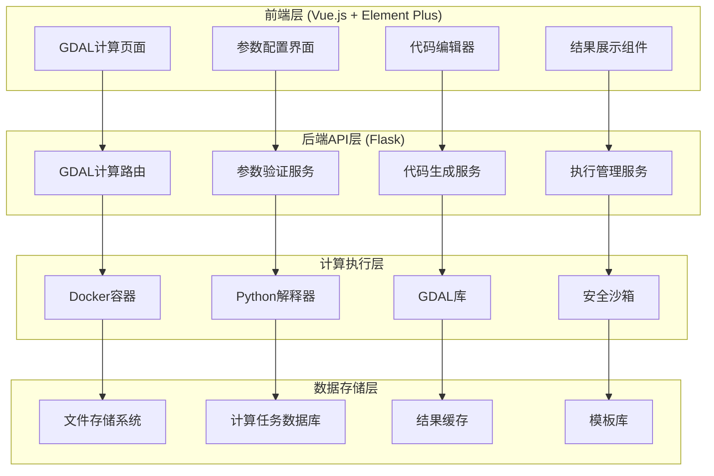
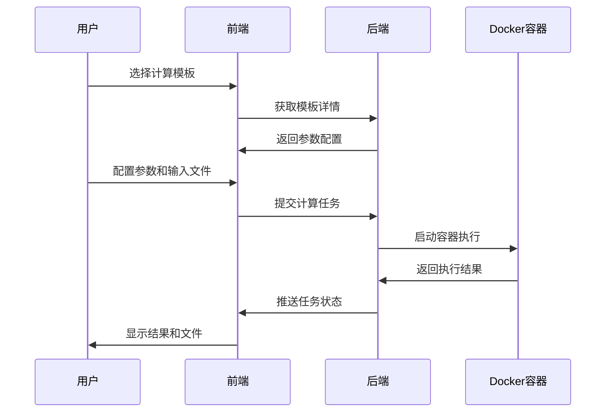
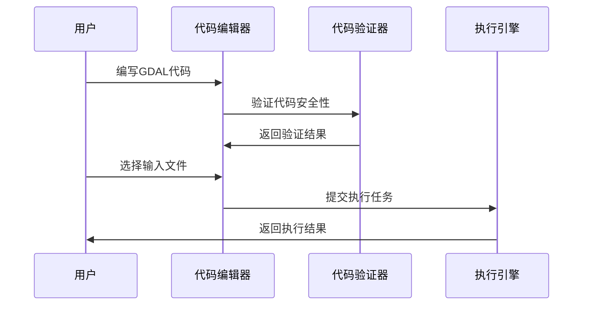

# GDAL通用计算平台架构方案

## 📋 项目概述

基于您现有的GIS Web平台，设计一个通用的GDAL计算模块，实现前端可视化配置、后端安全执行、结果可视化的完整GIS分析计算平台。

## 🎯 核心目标

1. **通用性**: 支持GDAL大部分常用函数和工具
2. **可视化**: 前端图形化配置计算参数
3. **安全性**: 后端沙箱化执行Python代码
4. **集成性**: 无缝集成到现有GIS平台
5. **扩展性**: 支持自定义计算脚本和第三方库

## 🏗️ 系统架构

### 1. 总体架构图



### 2. 技术栈选择

#### 前端技术栈
- **UI框架**: Vue 3 + Element Plus (现有)
- **地图引擎**: OpenLayers / Leaflet (现有)
- **代码编辑器**: Monaco Editor / CodeMirror
- **图表展示**: ECharts (现有)

#### 后端技术栈
- **Web框架**: Flask (现有)
- **容器化**: Docker + Docker Compose
- **Python环境**: Python 3.9+ + GDAL 3.x
- **任务队列**: Celery + Redis
- **安全沙箱**: RestrictedPython + 资源限制

#### 数据存储
- **关系数据库**: PostgreSQL (现有)
- **文件存储**: 本地文件系统 + 对象存储
- **缓存**: Redis
- **任务状态**: Celery结果后端

## 📊 数据库设计

### 3. 新增数据表结构

```sql
-- GDAL计算任务表
CREATE TABLE gdal_compute_tasks (
    id BIGINT PRIMARY KEY,
    user_id BIGINT REFERENCES users(id),
    task_name VARCHAR(255) NOT NULL,
    task_type VARCHAR(50) NOT NULL, -- 'template', 'custom', 'script'
    template_id BIGINT REFERENCES gdal_templates(id),
    input_files JSONB, -- 输入文件列表
    parameters JSONB, -- 计算参数
    generated_code TEXT, -- 生成的Python代码
    status VARCHAR(50) DEFAULT 'pending', -- pending, running, completed, failed
    progress INTEGER DEFAULT 0,
    result_files JSONB, -- 输出文件列表
    error_message TEXT,
    execution_time INTEGER, -- 执行时间(秒)
    created_at TIMESTAMP DEFAULT CURRENT_TIMESTAMP,
    updated_at TIMESTAMP DEFAULT CURRENT_TIMESTAMP,
    completed_at TIMESTAMP
);

-- GDAL计算模板表
CREATE TABLE gdal_templates (
    id BIGINT PRIMARY KEY,
    name VARCHAR(255) NOT NULL,
    category VARCHAR(100) NOT NULL, -- 'raster', 'vector', 'conversion', 'analysis'
    description TEXT,
    gdal_function VARCHAR(100) NOT NULL, -- 对应的GDAL函数名
    parameters_schema JSONB, -- 参数定义JSON Schema
    code_template TEXT, -- Python代码模板
    input_types JSONB, -- 支持的输入文件类型
    output_types JSONB, -- 输出文件类型
    example_usage TEXT,
    is_active BOOLEAN DEFAULT true,
    created_by BIGINT REFERENCES users(id),
    created_at TIMESTAMP DEFAULT CURRENT_TIMESTAMP,
    updated_at TIMESTAMP DEFAULT CURRENT_TIMESTAMP
);

-- GDAL计算结果表
CREATE TABLE gdal_compute_results (
    id BIGINT PRIMARY KEY,
    task_id BIGINT REFERENCES gdal_compute_tasks(id),
    file_path VARCHAR(500) NOT NULL,
    file_name VARCHAR(255) NOT NULL,
    file_type VARCHAR(50), -- 'raster', 'vector', 'text', 'image'
    file_size BIGINT,
    coordinate_system VARCHAR(50),
    bounds JSONB, -- 地理边界
    metadata JSONB, -- 文件元数据
    is_primary BOOLEAN DEFAULT false, -- 是否为主要结果文件
    created_at TIMESTAMP DEFAULT CURRENT_TIMESTAMP
);

-- GDAL函数库表
CREATE TABLE gdal_functions (
    id BIGINT PRIMARY KEY,
    function_name VARCHAR(100) NOT NULL UNIQUE,
    module_name VARCHAR(100) NOT NULL, -- 'gdal', 'ogr', 'osr', 'gdalutils'
    category VARCHAR(100) NOT NULL,
    description TEXT,
    parameters_info JSONB, -- 参数说明
    usage_examples JSONB, -- 使用示例
    documentation_url VARCHAR(500),
    is_available BOOLEAN DEFAULT true,
    risk_level VARCHAR(20) DEFAULT 'safe', -- safe, caution, restricted
    created_at TIMESTAMP DEFAULT CURRENT_TIMESTAMP
);
```

## 🔧 核心功能模块

### 4. 后端服务设计

#### 4.1 GDAL计算路由 (`routes/gdal_compute_routes.py`)

```python
from flask import Blueprint, request, jsonify
from services.gdal_compute_service import GDALComputeService
from services.gdal_template_service import GDALTemplateService
from models.db import execute_query
import logging

gdal_compute_bp = Blueprint('gdal_compute', __name__, url_prefix='/api/gdal')

@gdal_compute_bp.route('/templates', methods=['GET'])
def get_templates():
    """获取GDAL计算模板列表"""
    
@gdal_compute_bp.route('/templates/<int:template_id>', methods=['GET'])
def get_template_detail(template_id):
    """获取模板详情和参数配置"""
    
@gdal_compute_bp.route('/compute/submit', methods=['POST'])
def submit_compute_task():
    """提交计算任务"""
    
@gdal_compute_bp.route('/compute/status/<task_id>', methods=['GET'])
def get_task_status(task_id):
    """获取任务状态"""
    
@gdal_compute_bp.route('/compute/result/<task_id>', methods=['GET'])
def get_task_result(task_id):
    """获取任务结果"""
    
@gdal_compute_bp.route('/functions', methods=['GET'])
def get_gdal_functions():
    """获取可用的GDAL函数列表"""
```

#### 4.2 GDAL计算服务 (`services/gdal_compute_service.py`)

```python
import docker
import json
import tempfile
import os
from celery import Celery
from services.code_generator import GDALCodeGenerator
from services.security_validator import SecurityValidator

class GDALComputeService:
    def __init__(self):
        self.docker_client = docker.from_env()
        self.code_generator = GDALCodeGenerator()
        self.security_validator = SecurityValidator()
        
    def submit_task(self, task_data):
        """提交计算任务到队列"""
        
    def execute_in_container(self, code, input_files, params):
        """在Docker容器中执行GDAL代码"""
        
    def validate_code_security(self, code):
        """验证代码安全性"""
        
    def prepare_input_files(self, file_ids):
        """准备输入文件"""
        
    def collect_output_files(self, output_dir):
        """收集输出文件"""
```

#### 4.3 代码生成服务 (`services/gdal_code_generator.py`)

```python
from jinja2 import Template
import json

class GDALCodeGenerator:
    def __init__(self):
        self.base_template = """
import os
import sys
from osgeo import gdal, ogr, osr
import numpy as np
import logging

# 配置日志
logging.basicConfig(level=logging.INFO)
logger = logging.getLogger(__name__)

def main():
    try:
        # 输入文件路径
        
        {{ file.var_name }} = "{{ file.path }}"
        
        
        # 计算参数
        
        {{ param }} = {{ value | tojson }}
        
        
        # 主要计算逻辑
        {{ computation_code }}
        
        logger.info("计算完成")
        return True
        
    except Exception as e:
        logger.error(f"计算失败: {str(e)}")
        return False

if __name__ == "__main__":
    success = main()
    sys.exit(0 if success else 1)
"""
    
    def generate_from_template(self, template_id, parameters, input_files):
        """根据模板生成代码"""
        
    def generate_custom_code(self, gdal_functions, parameters, input_files):
        """生成自定义计算代码"""
        
    def validate_generated_code(self, code):
        """验证生成的代码"""
```

### 5. 前端组件设计

#### 5.1 主计算页面 (`views/GDALComputeView.vue`)

```vue
<template>
  <div class="gdal-compute-container">
    <!-- 左侧功能面板 -->
    <div class="left-panel">
      <el-tabs v-model="activeTab" type="border-card">
        <!-- 模板计算 -->
        <el-tab-pane label="模板计算" name="template">
          <TemplateComputePanel 
            @template-selected="onTemplateSelected"
            @parameters-changed="onParametersChanged"
          />
        </el-tab-pane>
        
        <!-- 自定义计算 -->
        <el-tab-pane label="自定义计算" name="custom">
          <CustomComputePanel 
            @function-selected="onFunctionSelected"
            @code-changed="onCodeChanged"
          />
        </el-tab-pane>
        
        <!-- 脚本编辑器 -->
        <el-tab-pane label="脚本编辑" name="script">
          <ScriptEditorPanel 
            v-model:code="customCode"
            @code-validated="onCodeValidated"
          />
        </el-tab-pane>
      </el-tabs>
    </div>
    
    <!-- 右侧预览和执行面板 -->
    <div class="right-panel">
      <CodePreviewPanel 
        :generated-code="generatedCode"
        :input-files="selectedInputFiles"
        :parameters="computeParameters"
        @execute="executeComputation"
      />
      
      <ExecutionStatusPanel 
        :task-status="currentTaskStatus"
        :execution-logs="executionLogs"
        @task-cancel="cancelTask"
      />
      
      <ResultDisplayPanel 
        :results="computationResults"
        @result-view="viewResult"
        @result-download="downloadResult"
      />
    </div>
  </div>
</template>
```

#### 5.2 模板计算面板 (`components/GDAL/TemplateComputePanel.vue`)

```vue
<template>
  <div class="template-compute-panel">
    <!-- 模板分类选择 -->
    <el-select v-model="selectedCategory" placeholder="选择功能分类">
      <el-option v-for="category in categories" :key="category.value" 
                 :label="category.label" :value="category.value" />
    </el-select>
    
    <!-- 模板列表 -->
    <div class="template-list">
      <el-card v-for="template in filteredTemplates" :key="template.id"
               class="template-card" 
               @click="selectTemplate(template)">
        <h4>{{ template.name }}</h4>
        <p>{{ template.description }}</p>
        <el-tag>{{ template.gdal_function }}</el-tag>
      </el-card>
    </div>
    
    <!-- 参数配置 -->
    <div v-if="selectedTemplate" class="parameter-config">
      <h3>参数配置</h3>
      <DynamicParameterForm 
        :schema="selectedTemplate.parameters_schema"
        v-model="parameters"
        @change="onParametersChange"
      />
    </div>
    
    <!-- 输入文件选择 -->
    <div class="input-files-section">
      <h3>输入文件</h3>
      <FileSelector 
        :file-types="selectedTemplate?.input_types"
        v-model="inputFiles"
        multiple
      />
    </div>
  </div>
</template>
```

#### 5.3 代码编辑器组件 (`components/GDAL/ScriptEditorPanel.vue`)

```vue
<template>
  <div class="script-editor-panel">
    <div class="editor-toolbar">
      <el-button-group>
        <el-button @click="formatCode" icon="Document">格式化</el-button>
        <el-button @click="validateCode" icon="Check">验证代码</el-button>
        <el-button @click="saveTemplate" icon="Collection">保存为模板</el-button>
      </el-button-group>
    </div>
    
    <!-- Monaco编辑器 -->
    <div ref="editorContainer" class="editor-container"></div>
    
    <!-- 代码验证结果 -->
    <div v-if="validationResult" class="validation-result">
      <el-alert :type="validationResult.type" :title="validationResult.message" />
    </div>
    
    <!-- 函数文档面板 -->
    <div class="docs-panel">
      <el-collapse v-model="activeDocSections">
        <el-collapse-item title="GDAL函数文档" name="gdal">
          <GDALFunctionDocs @function-insert="insertFunction" />
        </el-collapse-item>
        <el-collapse-item title="代码示例" name="examples">
          <CodeExamples @example-insert="insertExample" />
        </el-collapse-item>
      </el-collapse>
    </div>
  </div>
</template>
```

### 6. Docker容器配置

#### 6.1 Dockerfile

```dockerfile
FROM osgeo/gdal:ubuntu-small-3.8.4

# 安装Python依赖
RUN apt-get update && apt-get install -y \
    python3-pip \
    python3-dev \
    && rm -rf /var/lib/apt/lists/*

# 安装Python GDAL绑定和其他依赖
RUN pip3 install \
    gdal==$(gdal-config --version) \
    numpy \
    scipy \
    pandas \
    geopandas \
    rasterio \
    fiona \
    shapely \
    pyproj \
    matplotlib \
    pillow \
    restricted-python

# 创建工作目录
WORKDIR /workspace

# 复制安全执行脚本
COPY docker/secure_executor.py /usr/local/bin/
COPY docker/resource_limits.sh /usr/local/bin/

# 设置资源限制
RUN chmod +x /usr/local/bin/resource_limits.sh

# 创建非root用户
RUN useradd -m -u 1000 gdaluser
USER gdaluser

ENTRYPOINT ["python3", "/usr/local/bin/secure_executor.py"]
```

#### 6.2 安全执行器 (`docker/secure_executor.py`)

```python
import os
import sys
import tempfile
import subprocess
import resource
import signal
import time
from RestrictedPython import compile_restricted
from RestrictedPython.Guards import safe_globals

class SecureGDALExecutor:
    def __init__(self):
        self.max_execution_time = 3600  # 1小时
        self.max_memory = 2 * 1024 * 1024 * 1024  # 2GB
        self.max_cpu_time = 1800  # 30分钟CPU时间
        
    def set_resource_limits(self):
        """设置资源限制"""
        # 设置内存限制
        resource.setrlimit(resource.RLIMIT_AS, (self.max_memory, self.max_memory))
        # 设置CPU时间限制
        resource.setrlimit(resource.RLIMIT_CPU, (self.max_cpu_time, self.max_cpu_time))
        # 设置文件描述符限制
        resource.setrlimit(resource.RLIMIT_NOFILE, (100, 100))
        
    def validate_code(self, code):
        """验证代码安全性"""
        try:
            # 使用RestrictedPython编译代码
            compiled = compile_restricted(code, '<string>', 'exec')
            if compiled.errors:
                return False, compiled.errors
            return True, None
        except Exception as e:
            return False, str(e)
            
    def execute_code(self, code_file, input_dir, output_dir):
        """安全执行代码"""
        self.set_resource_limits()
        
        # 设置环境变量
        os.environ['INPUT_DIR'] = input_dir
        os.environ['OUTPUT_DIR'] = output_dir
        
        # 执行代码
        try:
            result = subprocess.run([
                'python3', code_file
            ], 
            timeout=self.max_execution_time,
            capture_output=True,
            text=True,
            cwd=output_dir
            )
            
            return {
                'success': result.returncode == 0,
                'stdout': result.stdout,
                'stderr': result.stderr,
                'returncode': result.returncode
            }
        except subprocess.TimeoutExpired:
            return {
                'success': False,
                'error': 'Execution timeout',
                'stderr': 'Task exceeded maximum execution time'
            }
```

## 🎯 预设计算模板

### 7. 常用GDAL操作模板

#### 7.1 栅格数据处理模板

```json
{
  "raster_reproject": {
    "name": "栅格重投影",
    "category": "raster",
    "description": "将栅格数据转换到指定坐标系",
    "gdal_function": "gdalwarp",
    "parameters_schema": {
      "type": "object",
      "properties": {
        "target_crs": {
          "type": "string",
          "title": "目标坐标系",
          "default": "EPSG:4326",
          "enum": ["EPSG:4326", "EPSG:3857", "EPSG:2154"]
        },
        "resampling": {
          "type": "string",
          "title": "重采样方法",
          "default": "nearest",
          "enum": ["nearest", "bilinear", "cubic", "average"]
        },
        "output_format": {
          "type": "string",
          "title": "输出格式",
          "default": "GTiff",
          "enum": ["GTiff", "HFA", "PNG", "JPEG"]
        }
      }
    },
    "code_template": """
# 栅格重投影
from osgeo import gdal
import os

input_file = "{{ input_files[0].path }}"
output_file = os.path.join(os.environ['OUTPUT_DIR'], "reprojected.tif")

# 执行重投影
gdal.Warp(
    output_file,
    input_file,
    dstSRS="{{ target_crs }}",
    resampleAlg=gdal.GRA_{{ resampling.upper() }},
    format="{{ output_format }}"
)

logger.info(f"重投影完成: {output_file}")
"""
  },
  
  "raster_clip": {
    "name": "栅格裁剪",
    "category": "raster", 
    "description": "使用矢量边界裁剪栅格数据",
    "gdal_function": "gdalwarp",
    "parameters_schema": {
      "type": "object",
      "properties": {
        "crop_to_cutline": {
          "type": "boolean",
          "title": "裁剪到边界",
          "default": true
        },
        "nodata_value": {
          "type": "number",
          "title": "无数据值",
          "default": -9999
        }
      }
    }
  }
}
```

#### 7.2 矢量数据处理模板

```json
{
  "vector_reproject": {
    "name": "矢量重投影",
    "category": "vector",
    "description": "将矢量数据转换到指定坐标系",
    "gdal_function": "ogr2ogr",
    "code_template": """
from osgeo import ogr, osr

input_file = "{{ input_files[0].path }}"
output_file = os.path.join(os.environ['OUTPUT_DIR'], "reprojected.shp")

# 设置目标坐标系
target_srs = osr.SpatialReference()
target_srs.ImportFromEPSG({{ target_epsg }})

# 执行重投影
gdal.VectorTranslate(
    output_file,
    input_file,
    dstSRS=target_srs,
    format="ESRI Shapefile"
)
"""
  },
  
  "vector_buffer": {
    "name": "缓冲区分析",
    "category": "analysis",
    "description": "创建矢量要素的缓冲区",
    "gdal_function": "ogr",
    "parameters_schema": {
      "type": "object",
      "properties": {
        "buffer_distance": {
          "type": "number",
          "title": "缓冲距离",
          "minimum": 0
        },
        "buffer_unit": {
          "type": "string",
          "title": "距离单位",
          "enum": ["meter", "degree", "foot"]
        }
      }
    }
  }
}
```

## 🔒 安全策略

### 8. 代码安全验证

#### 8.1 安全规则配置

```python
SECURITY_RULES = {
    # 禁止的模块
    'forbidden_modules': [
        'subprocess', 'os.system', 'eval', 'exec',
        'open', '__import__', 'compile', 'reload'
    ],
    
    # 允许的GDAL/OGR函数
    'allowed_gdal_functions': [
        'gdal.Open', 'gdal.Warp', 'gdal.Translate', 'gdal.Info',
        'ogr.Open', 'ogr.GetDriverByName', 'osr.SpatialReference'
    ],
    
    # 资源限制
    'limits': {
        'max_execution_time': 3600,
        'max_memory_mb': 2048,
        'max_output_files': 10,
        'max_file_size_mb': 1024
    },
    
    # 文件访问限制
    'file_access': {
        'allowed_extensions': ['.tif', '.shp', '.geojson', '.gpkg', '.nc'],
        'forbidden_paths': ['/etc', '/usr', '/bin', '/sbin']
    }
}
```

#### 8.2 代码扫描器

```python
import ast
import re

class CodeSecurityScanner:
    def __init__(self, rules):
        self.rules = rules
        
    def scan_code(self, code):
        """扫描代码安全性"""
        issues = []
        
        # AST语法分析
        try:
            tree = ast.parse(code)
            issues.extend(self._scan_ast(tree))
        except SyntaxError as e:
            issues.append(f"语法错误: {str(e)}")
            
        # 正则表达式扫描
        issues.extend(self._scan_patterns(code))
        
        return issues
        
    def _scan_ast(self, tree):
        """AST节点扫描"""
        issues = []
        
        for node in ast.walk(tree):
            # 检查导入模块
            if isinstance(node, ast.Import):
                for alias in node.names:
                    if alias.name in self.rules['forbidden_modules']:
                        issues.append(f"禁止导入模块: {alias.name}")
                        
            # 检查函数调用
            elif isinstance(node, ast.Call):
                if hasattr(node.func, 'id'):
                    func_name = node.func.id
                    if func_name in self.rules['forbidden_modules']:
                        issues.append(f"禁止调用函数: {func_name}")
                        
        return issues
        
    def _scan_patterns(self, code):
        """正则模式扫描"""
        issues = []
        
        dangerous_patterns = [
            r'subprocess\.',
            r'os\.system',
            r'eval\s*\(',
            r'exec\s*\(',
            r'__import__'
        ]
        
        for pattern in dangerous_patterns:
            if re.search(pattern, code):
                issues.append(f"发现危险模式: {pattern}")
                
        return issues
```

## 📋 实施步骤

### 9. 开发计划

#### 第一阶段：基础架构 (2-3周)
1. **数据库设计**
   - 创建GDAL相关数据表
   - 设计任务状态管理机制
   - 建立模板存储结构

2. **Docker环境搭建**
   - 构建GDAL计算容器
   - 配置安全执行环境
   - 实现资源限制机制

3. **后端API开发**
   - 实现基础路由和服务
   - 开发代码生成器
   - 建立安全验证器

#### 第二阶段：核心功能 (3-4周)
1. **模板系统**
   - 开发常用GDAL操作模板
   - 实现参数配置界面
   - 建立模板管理功能

2. **前端界面**
   - 开发计算配置页面
   - 实现代码编辑器
   - 建立结果展示组件

3. **执行引擎**
   - 实现异步任务执行
   - 开发进度监控机制
   - 建立错误处理系统

#### 第三阶段：高级功能 (2-3周)
1. **自定义计算**
   - 开发可视化函数配置
   - 实现自定义代码编辑
   - 建立代码模板保存

2. **结果集成**
   - 实现结果文件管理
   - 开发地图可视化集成
   - 建立结果分享机制

3. **性能优化**
   - 实现计算结果缓存
   - 优化容器启动速度
   - 建立资源池管理

#### 第四阶段：完善和部署 (1-2周)
1. **测试和调试**
   - 单元测试编写
   - 集成测试执行
   - 性能测试评估

2. **文档和培训**
   - 用户使用文档
   - 开发者文档
   - 操作培训材料

## 🎮 用户使用流程

### 10. 典型使用场景

#### 场景1：模板计算


#### 场景2：自定义脚本


## 📈 扩展功能

### 11. 未来增强功能

#### 11.1 机器学习集成
- 集成scikit-learn、TensorFlow
- 遥感影像分类和识别
- 地物变化检测算法

#### 11.2 大数据处理
- 集成Dask分布式计算
- 支持云存储数据源
- 实现分块并行处理

#### 11.3 实时计算
- WebSocket实时进度推送
- 流式数据处理支持
- 实时结果预览

#### 11.4 协作功能
- 多用户协作计算
- 计算流程分享
- 版本控制和回滚

## 🔍 GitHub相似项目参考

### 12. 开源项目分析

#### 12.1 类似项目
1. **QGIS Processing Framework**
   - 图形化算法配置
   - 插件式扩展机制
   - 参考其参数配置界面设计

2. **Jupyter Notebook + GDAL**
   - 交互式代码执行
   - 结果可视化展示
   - 参考其代码编辑和执行模式

3. **PostGIS + pgRouting**
   - SQL函数化GIS计算
   - 参考其函数封装方式

4. **Actinia (mundialis)**
   - 基于GRASS GIS的云计算平台
   - RESTful API设计
   - 异步任务处理机制

#### 12.2 技术借鉴点
- **参数化计算模板设计**
- **安全代码执行沙箱**
- **可视化结果展示方案**
- **分布式计算架构**

## 📝 总结

这个GDAL通用计算平台将为您的GIS系统提供强大的空间分析计算能力，通过模板化、可视化、安全化的设计，让用户能够便捷地进行各种GIS分析操作。整个方案充分考虑了安全性、扩展性和用户体验，可以成为您GIS平台的重要功能增强。

关键优势：
- 🎯 **通用性强**: 支持GDAL大部分功能
- 🛡️ **安全可靠**: 多层安全防护机制  
- 🎨 **易于使用**: 图形化配置界面
- 🔧 **易于扩展**: 模块化设计架构
- 📊 **结果直观**: 集成地图可视化

建议优先实现基础模板功能，然后逐步扩展到自定义计算和高级功能。 