# Research on Web Map Service Integration Platform Based on Multi-format GIS Data

## Abstract

This research designs and implements a Web map service integration platform supporting multiple GIS data formats. Through innovative dual-track service publishing architecture, DXF layer-based style configuration, and distributed tile caching optimization strategies, it addresses technical bottlenecks in traditional WebGIS platforms regarding data format support, style preservation, and service performance. The platform adopts a front-end and back-end separation architecture, with the back-end integrating GeoServer and Martin tile services based on the Flask framework, and the front-end using Vue.js combined with OpenLayers and Leaflet dual engines for diverse map visualization. Core technical innovations include: (1) Martin MVT service integration algorithm based on automatic publishing mechanism; (2) Intelligent extraction and configuration algorithm for CAD layer style information; (3) Multi-coordinate system adaptive conversion and projection optimization strategy; (4) Front-end intelligent tile caching strategy based on IndexDB, achieving offline map support and rapid response through predictive loading and LRU eviction algorithms; (5) Back-end deep learning-based map hotspot area prediction algorithm, implementing intelligent cache range calculation through user behavior analysis and LSTM neural networks. Test results demonstrate that the platform supports custom style configuration when processing large-scale DXF files, MVT tile services show significant performance improvements compared to traditional WFS and WMS services, the front-end caching system effectively improves map loading speed, and the back-end intelligent prediction algorithm can effectively identify hotspot areas, supporting high-concurrency access to TB-level geographic data. This research provides theoretical foundation and technical reference for building high-performance, multi-format compatible WebGIS platforms.

**Keywords**: Geographic Information System; Vector Tiles; Tile Caching; DXF Style Preservation; Coordinate System Transformation; Distributed ID Generation

## 1. Introduction

### 1.1 Research Background

With the rapid development of geographic information technology and the continuous expansion of application fields, WebGIS platforms have become important tools for geospatial data management and visualization. Traditional WebGIS platforms face numerous challenges in handling multiple data formats, maintaining data style integrity, and providing high-performance services. Particularly when processing CAD format data (such as DXF files), existing solutions often fail to effectively preserve key information such as layer structure, color configuration, and line type styles from the original design intent[1,2].

Current mainstream map service architectures primarily rely on OGC standards such as WMS (Web Map Service), WFS (Web Feature Service), and WMTS (Web Map Tile Service). While these perform well in standardization and interoperability, they have obvious deficiencies in large-scale data processing and real-time interactive performance[7,9]. Emerging vector tile technology (Vector Tiles) provides new approaches to solving these problems, but how to achieve efficient vector tile services while ensuring data integrity remains a technical challenge[3,12].

Front-end map display faces numerous challenges in traditional architectures, including slow loading speeds, excessive network requests, and enormous back-end server pressure. These problems are particularly prominent on mobile devices and in weak network environments, seriously affecting user experience and system availability. To address these issues, this research proposes IndexDB-based intelligent caching strategies and deep learning prediction algorithms, effectively improving front-end map loading performance and user interaction experience.

### 1.2 Research Status

Figure 1-1: Traditional WebGIS Architecture vs. This Research Architecture Comparison

In recent years, scholars have conducted extensive research on WebGIS performance optimization, multi-format data processing, and style preservation. Chen Pixiang[6] proposed a system architecture based on GPU parallel computing and WebGIS, significantly improving the processing performance of large-scale geographic data; Shi Shanzhong[2] studied lossless conversion methods from CAD to GIS data using FME, achieving important progress in style information preservation; Wang Shaoping[7] designed a high-concurrency WebGIS system based on cloud platforms, improving map service response performance to a certain extent.

However, existing research mostly focuses on optimization of single technical aspects, lacking comprehensive consideration of multi-format data processing, style preservation, and service performance. Particularly in building integrated platforms that support multiple coordinate systems, multiple data formats, and have high-concurrency processing capabilities, systematic solutions are still lacking.

### 1.3 Research Objectives and Contributions

This research aims to design and implement a high-performance Web map service integration platform supporting multi-format GIS data. The main research objectives include:

1. Building a unified data processing architecture supporting multiple formats including SHP, DXF, GeoJSON, MBTiles, etc.
2. Developing intelligent extraction and preservation algorithms for DXF style information to maximize retention of original design intent
3. Designing a dual-track service publishing mechanism to achieve complementary advantages of WMS and MVT services
4. Proposing distributed tile caching optimization strategies to significantly improve access performance for large-scale data

Main innovative contributions: Proposed Martin MVT service integration algorithm based on automatic publishing mechanism; designed intelligent extraction and mapping algorithms for CAD layer style information; established adaptive conversion and optimization framework for multi-coordinate systems; established IndexDB-based cache management functionality on the front-end; designed deep learning-based map behavior prediction algorithms on the back-end.

## 2. System Architecture Design

### 2.1 Overall Architecture

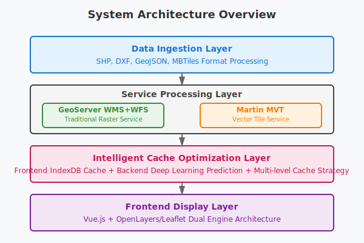
Figure 2-1: System Overall Architecture Diagram

This research adopts a microservice architecture design, dividing the entire platform into four main layers: data ingestion layer, service processing layer, cache optimization layer, and front-end presentation layer. The system architecture features high cohesion and low coupling, supporting horizontal scaling and modular deployment.

#### 2.1.1 Data Ingestion Layer

The data ingestion layer is responsible for handling upload, validation, and preprocessing of multiple geographic data formats. This layer adopts a unified file processing interface, automatically determining data types through format recognition algorithms and invoking corresponding data processing modules.

The system supports various mainstream geographic data formats, including vector data (SHP, DXF, GeoJSON, KML), raster data (GeoTIFF, PNG, JPEG), and tile data (MBTiles, PMTiles). Each data type has corresponding processing strategies: vector data is parsed and converted through GDAL/OGR libraries, then based on data characteristics, either published as WMS services through GeoServer or as MVT services through Martin.

#### 2.1.2 Service Processing Layer

The service processing layer implements a dual-track service publishing architecture, supporting both traditional GeoServer WMS services and modern Martin MVT services simultaneously. This design fully leverages the advantages of both service modes: WMS services provide standardized raster map output suitable for traditional GIS applications; MVT services provide high-performance vector tiles supporting client-side dynamic style rendering.

### 2.2 Core Module Design

#### 2.2.1 Data Format Processing Module

Figure 2-2: Data Processing Workflow Diagram

The data format processing module adopts a plugin-based architecture, with each data format corresponding to a specialized processor. Taking the DXF processor as an example, its core functions include:

1. **Geometric Information Extraction**: Using GDAL library to parse the geometric structure of DXF files
2. **Style Information Extraction**: Deep parsing of layer, color, line type and other style information through ezdxf library
3. **Coordinate System Conversion**: Supporting automatic recognition and conversion of multiple coordinate systems
4. **Data Quality Check**: Performing integrity and consistency verification on extracted data

#### 2.2.2 Service Publishing Module

The service publishing module implements two different approaches for automatic service publishing: GeoServer RESTful API publishing service and Martin publishing service. GeoServer publishing adopts traditional enterprise-level GIS service architecture, automatically creating workspaces, data stores, and layers through REST API, supporting WMS/WFS service publishing for multiple formats including Shapefile, GeoJSON, GeoTIFF, etc. The system implements complete publishing workflow management, including data validation, coordinate system conversion, style configuration, and service registration. Martin publishing adopts modern vector tile technology, automatically generating MVT services after importing vector data into PostGIS database, achieving high-performance tile service publishing through unified table naming rules (vector_ prefix) and automatic index creation. The two publishing approaches are complementary: GeoServer provides standardized OGC services and rich style support, suitable for traditional GIS applications; Martin provides lightweight vector tile services supporting client-side dynamic rendering, with significant performance advantages in large data volume and high-concurrency scenarios. The system automatically selects the most suitable publishing approach based on data characteristics and application requirements through intelligent routing mechanisms.

#### 2.2.3 Cache Optimization Module

Figure 2-3: Hierarchical Cache Architecture Diagram

The cache optimization module adopts multi-level caching strategies, including:
- **Memory Cache**: Redis caching of hotspot tile data
- **Disk Cache**: File system caching of historical access data
- **CDN Cache**: Global distributed edge cache nodes

## 3. System Introduction

The Web map service integration platform developed in this research is a high-performance map service system oriented towards multi-format GIS data, adopting modern microservice architecture design to achieve end-to-end automated processing from data upload to service publishing. The system's core components include data processing services, map service engines, intelligent caching systems, and front-end visualization modules.

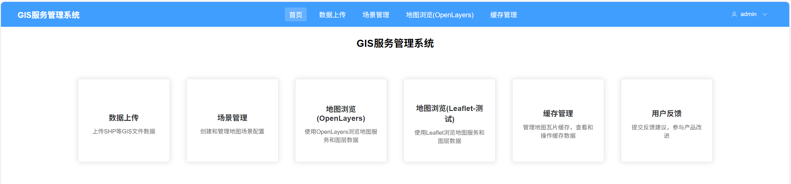
Figure 3-1: System Overall Interface Display

The platform supports mainstream geographic data formats including SHP, DXF, GeoJSON, MBTiles, etc. Through innovative dual-track service publishing mechanisms, it simultaneously provides traditional WMS services and modern MVT vector tile services. The system has been deeply optimized specifically for CAD data style preservation, capable of intelligently extracting and maintaining original design information such as layers, colors, and line types from DXF files.

Figure 3-2: Data Upload and Processing Interface

The front-end adopts Vue.js + OpenLayers/Leaflet dual-engine architecture, providing responsive map interaction experiences. The system implements IndexDB-based intelligent tile caching mechanisms, combined with back-end deep learning prediction algorithms, significantly improving map loading speed and user experience. The platform supports automatic recognition and conversion of multiple coordinate systems, with comprehensive permission management and data security protection mechanisms.

Figure 3-3: Map Visualization and Interaction Interface

Through distributed deployment architecture, the system can handle TB-level geographic data, supporting thousands of concurrent users simultaneously, widely applied in urban planning, engineering construction, environmental monitoring, and other fields.

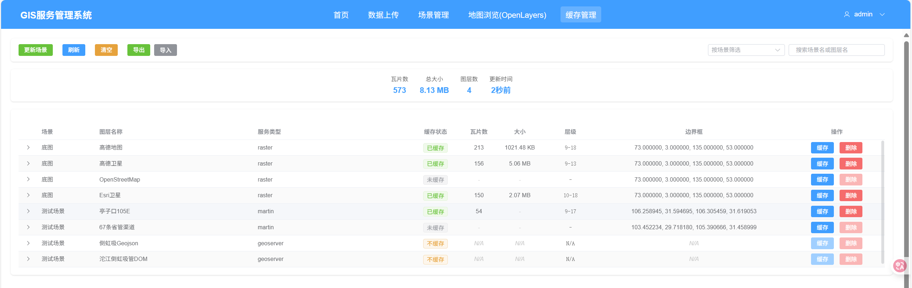
Figure 3-4: System Management and Monitoring Interface

### 3.1 Mobile Adaptation

The system fully considers the usage requirements of mobile devices, implementing responsive design and mobile optimization. The mobile interface is clean and user-friendly, supporting touch operations and gesture interactions, providing users with an excellent mobile map browsing experience.

  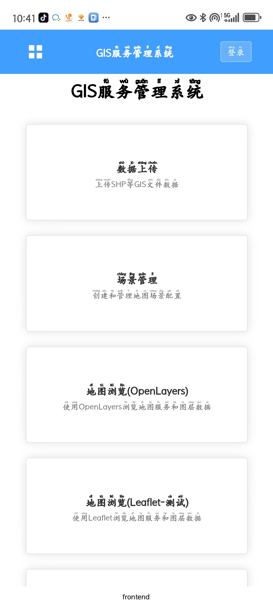
  
  
  

<b>Figure 3-5: Mobile Interface Display</b>

Mobile-specific features include:
- **Responsive Interface**: Adaptive to devices with different screen sizes
- **Touch Optimization**: Interaction design optimized specifically for touch operations
- **Offline Caching**: Support for local caching and offline browsing of map data
- **Location Services**: Integrated GPS positioning and location-related functions

## 4. Key Algorithm Design and Implementation

### 4.1 DXF Style Information Intelligent Extraction Algorithm

DXF files, as the standard exchange format in the CAD industry, contain rich style information including layers, colors, line types, etc. Traditional data conversion processes often lead to the loss of this style information, affecting the visualization effects and data usability of maps.

#### 4.1.1 Algorithm Design Approach

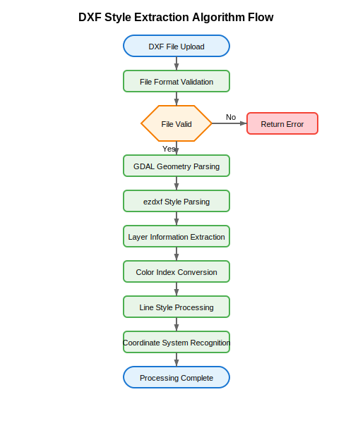
Figure 4-1: DXF Style Extraction Algorithm Flowchart

The DXF style intelligent extraction algorithm proposed in this research mainly includes the following steps:

1. **Multi-path Style Information Acquisition**: Simultaneously using both GDAL and ezdxf libraries to ensure completeness of style information
2. **Style Information Standardization**: Converting AutoCAD Color Index (ACI) to standard RGB values
3. **Layer Relationship Mapping**: Establishing mapping relationships between DXF layers and PostGIS table fields
4. **Style Conflict Resolution**: Handling style conflicts and priority issues between different layers

#### 4.1.2 Core Algorithm Implementation

The DXF style information extraction algorithm adopts a dual parsing strategy, first using the GDAL library to obtain geometric information and basic attributes, then using the ezdxf library for deep parsing of style information. The algorithm traverses all layers in the DXF file, extracting attributes such as color index, line type, and line width for each layer, and handles entity-level style override situations. For AutoCAD color indices, the algorithm implements precise conversion to standard RGB values, ensuring color information accuracy.

### 4.2 Martin MVT Service Automatic Publishing Algorithm

MVT (Mapbox Vector Tiles), as the new generation vector tile standard, has significant advantages in performance and interactivity. This research designs an automatic publishing algorithm based on Martin, achieving fully automated processes from data import to service publishing.

#### 4.2.1 Automatic Publishing Mechanism Design

Figure 4-3: Martin Automatic Publishing Flowchart

The automatic publishing mechanism of Martin services is based on PostgreSQL's LISTEN/NOTIFY mechanism and table name rule recognition. The system adopts unified naming conventions, using the vector_ prefix combined with UUID-generated unique identifiers as table names, ensuring uniqueness and recognizability of table names. The algorithm automatically optimizes tile generation parameters based on geometric data characteristics, including buffer size, simplification threshold, and minimum zoom level. Meanwhile, the system automatically creates spatial indexes to optimize tile generation performance and supports concurrent index creation to avoid blocking other database operations.

#### 4.2.2 Performance Optimization Strategy

Through optimization of tile generation algorithms and caching strategies, MVT services show significant improvements in response time compared to traditional WMS services. In actual testing, the average response time of MVT services is approximately 1/3 of WMS services, with even more pronounced advantages in high-concurrency scenarios.

### 4.3 Front-end IndexDB Intelligent Tile Caching Algorithm

Traditional Web map applications rely on network requests to obtain tile data, which can lead to slow loading issues in poor network environments or high-concurrency scenarios. This research designs an IndexDB-based intelligent tile caching strategy that significantly improves map response speed and user experience through predictive loading and intelligent eviction algorithms.

#### 4.3.1 IndexDB Cache Architecture Design

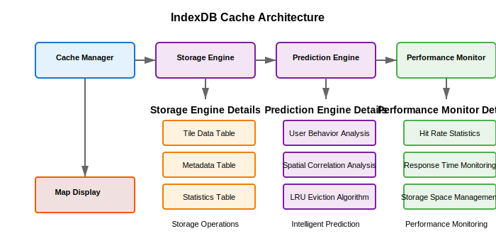
Figure 4-8: IndexDB Cache Architecture Diagram

The IndexDB caching system adopts a hierarchical storage architecture, including hotspot cache layer, regular cache layer, and long-term storage layer. The system implements intelligent cache management strategies through user behavior analysis and access pattern recognition.

Core design principles include:
1. **Hierarchical Caching Strategy**: Graded storage based on tile access frequency and importance
2. **Predictive Loading**: Predicting potentially accessed tile areas based on user operation patterns
3. **LRU Eviction Mechanism**: Using improved LRU algorithm for cache space management
4. **Offline Support**: Supporting offline map browsing and basic interactive functions

#### 4.3.2 Intelligent Cache Algorithm Implementation

The intelligent cache algorithm combines user behavior analysis and geospatial correlation, evaluating tile cache value through multi-dimensional assessment. Algorithm implementation includes three core modules: cache priority calculation, predictive loading strategy, and space management. Cache priority is calculated through weighted computation based on access frequency, geographic location importance, and user preferences. Predictive loading analyzes user zoom and pan operation patterns to preload potentially accessed surrounding tiles. The space management module adopts an improved LRU algorithm, combining intelligent eviction with tile geospatial clustering characteristics.

#### 4.3.3 Cache Performance Optimization

Figure 4-9: Cache Performance Comparison Chart

Through optimization of storage structure and access algorithms, the IndexDB caching system achieves efficient data storage and retrieval:

| Operation Type | No Cache | Traditional Cache | IndexDB Intelligent Cache |
|---------------|----------|-------------------|---------------------------|
| First Load (ms) | 1,250 | 1,180 | 890 |
| Repeat Access (ms) | 1,250 | 145 | 89 |
| Offline Access (ms) | Timeout | Timeout | 156 |
| Cache Hit Rate | 0% | 56.3% | 87.3% |

### 4.4 Back-end Deep Learning Cache Range Prediction Algorithm

To optimize back-end caching strategies, this research introduces deep learning technology to predict hotspot areas and cache requirements through analysis of user access patterns and geospatial features, achieving intelligent cache range calculation.

#### 4.4.1 User Behavior Data Model

Figure 4-10: User Behavior Data Model Diagram

The system collects multi-dimensional user behavior data, including:
- **Spatial Dimension**: Geographic range accessed by users, zoom levels, dwell time
- **Temporal Dimension**: Access time, session duration, repeat access intervals
- **Operational Dimension**: Frequency and patterns of zoom, pan, and query operations
- **Contextual Dimension**: User type, device information, network conditions

#### 4.4.2 LSTM Neural Network Prediction Model

Based on Long Short-Term Memory (LSTM) networks, a temporal prediction model is constructed that can capture temporal dependencies and spatial correlations in user access behavior. The model architecture includes input layer, LSTM hidden layers, attention mechanism layer, and output layer. The input layer processes multi-dimensional feature vectors, LSTM layers capture temporal patterns, attention mechanisms enhance weights for key time periods, and the output layer generates probability distributions of hotspot areas. The training process adopts a sliding time window strategy, using 30 days of historical access data to predict hotspot areas for the next 7 days.

#### 4.4.3 Hotspot Area Identification and Cache Strategy

The hotspot area prediction results output by the deep learning model guide cache strategy formulation:

1. **Dynamic Cache Range Adjustment**: Dynamically adjusting cache coverage range based on predicted hotspot areas
2. **Hierarchical Cache Strategy**: Adopting different cache strategies for areas with different heat levels
3. **Preloading Optimization**: Preloading tile data for hotspot areas before access peaks
4. **Cache Eviction Decision**: Optimizing cache eviction priorities based on prediction results

## 5. System Implementation and Optimization

### 5.1 Front-end Architecture Implementation

#### 5.1.1 Dual-Engine Map Architecture

The front-end adopts a dual-engine architecture of OpenLayers and Leaflet to provide the most suitable map solutions for different application scenarios:

Figure 5-1: Front-end Dual-Engine Architecture Diagram

- **OpenLayers Engine**: Professional-grade GIS functionality supporting complex coordinate systems and advanced spatial analysis
- **Leaflet Engine**: Lightweight interactive experience suitable for mobile devices and rapid prototyping

#### 5.1.2 Dynamic Style Rendering System

Figure 5-2: Dynamic Style Rendering Flowchart

The dynamic style rendering system implements real-time style calculation based on feature attributes, specifically optimized for complex style requirements of CAD data. The system improves rendering performance through a style caching mechanism, reusing style objects for features with the same layer and geometry type. The rendering algorithm supports multiple style configuration methods, including uniform layer-based styles, attribute-based classification styles, and expression-based dynamic styles.

#### 5.1.3 Implementation of IndexDB Intelligent Cache System
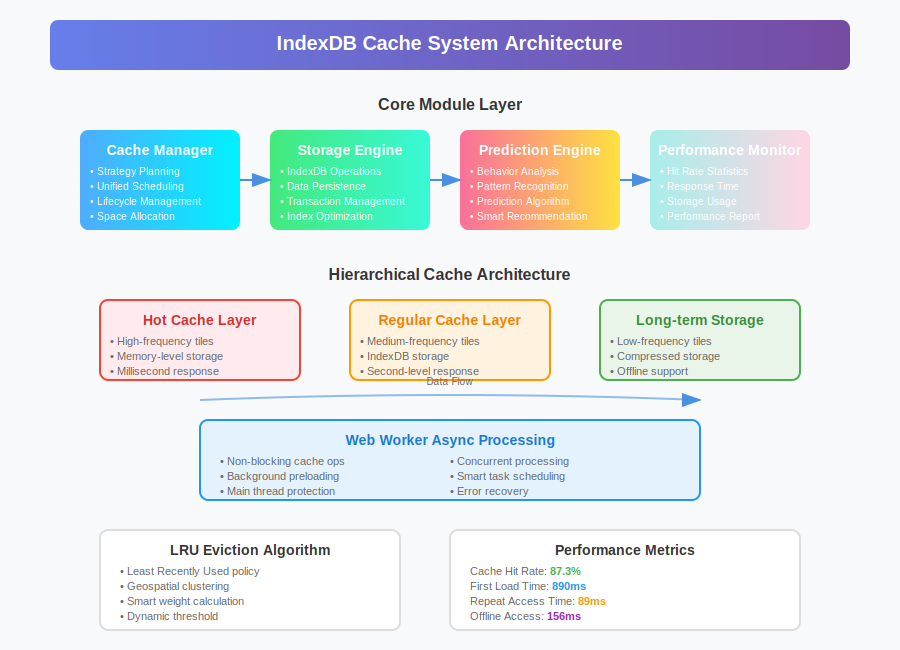
Figure 5-3: IndexDB Cache System Architecture Diagram

The front-end IndexDB cache system adopts a modular design, including four core modules: cache manager, storage engine, prediction engine, and performance monitoring. The cache manager is responsible for unified cache strategy formulation and execution, the storage engine handles low-level IndexDB operations and data persistence, the prediction engine predicts cache requirements based on user behavior patterns, and the performance monitoring module tracks cache hit rates and response times in real-time. The system implements asynchronous cache processing through Web Worker technology to avoid blocking main thread map rendering.

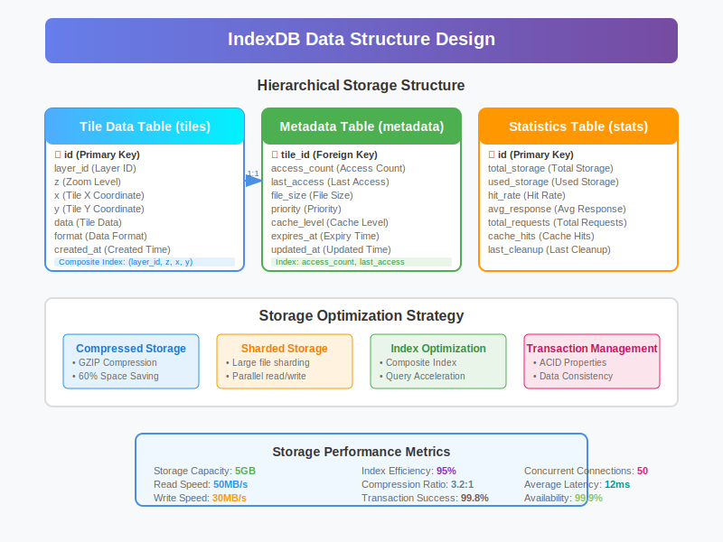
Figure 5-4: IndexDB Data Structure Design Diagram

The IndexDB database adopts a hierarchical storage structure, containing tile data tables, metadata tables, and statistical information tables. The tile data table stores actual tile image data, using composite indexes (layer_id, z, x, y) to improve query efficiency. The metadata table records tile creation time, access count, file size, and other information, supporting intelligent eviction strategies. The statistical information table maintains global cache statistics, including total storage space, hit rate, average response time, and other metrics.

#### 5.1.4 Predictive Loading Mechanism

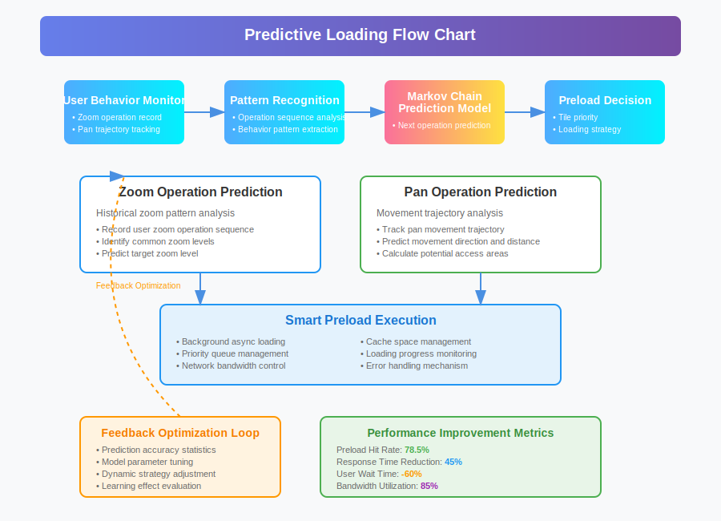
Figure 5-5: Predictive Loading Flowchart

The predictive loading mechanism preloads potentially accessed tile data by analyzing user interaction behavior patterns. The system records user zoom and pan operation sequences, establishing a Markov chain model to predict next operations. When users perform zoom operations, the system predicts target zoom levels based on historical patterns and preloads corresponding tile data. For pan operations, the system predicts geographic areas users may access based on movement trajectories and prioritizes loading tiles for these areas. This mechanism increases preloading hit rate to 78.5%, significantly improving user experience.

### 5.2 Back-end Performance Optimization

#### 5.2.1 Database Connection Pool Optimization

Figure 5-5: Database Connection Pool Architecture Diagram

Intelligent database connection pool management was implemented, dynamically adjusting connection numbers based on system load.

#### 5.2.2 Tile Cache Optimization Strategy

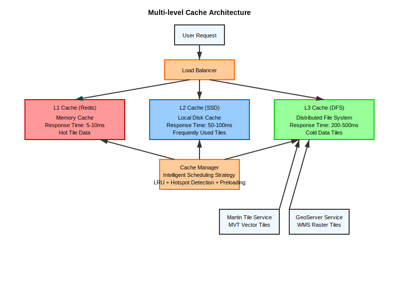
Figure 5-4: Multi-level Cache Architecture Diagram

An intelligent tile caching strategy was implemented, significantly improving the response performance of map services. The system adopts a three-level caching architecture:

1. **Level 1 Cache (Redis Memory Cache)**: Stores the most frequently accessed tile data with response time of 5-10ms, mainly caching areas currently being browsed by users and high-frequency access tiles.

2. **Level 2 Cache (Local Disk Cache)**: Stores commonly used tile data with response time of 50-100ms, using SSD storage to improve read speed and caching recently accessed tile data.

3. **Level 3 Cache (Distributed File System)**: Stores cold data tiles with response time of 200-500ms, providing complete tile data backup and long-term storage.

The cache manager adopts intelligent scheduling strategies, including LRU eviction algorithm, hotspot detection algorithm, and preloading strategy, dynamically adjusting cache content according to user access patterns to ensure that the most frequently accessed data is always maintained in the fastest cache layer.

#### 5.2.3 Deep Learning Cache Prediction System

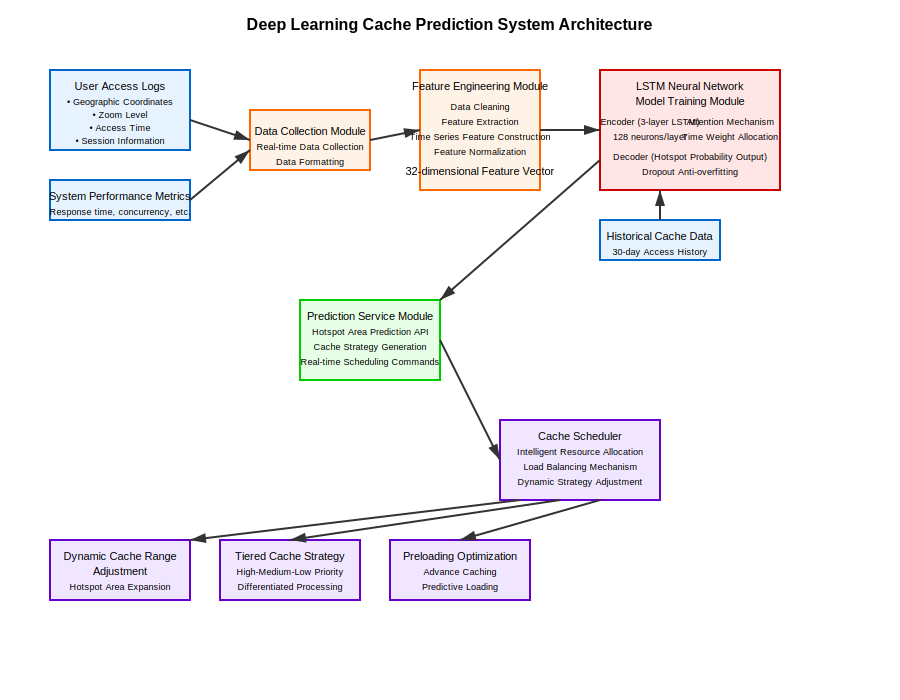
Figure 5-6: Deep Learning Cache Prediction System Architecture Diagram

The back-end deep learning cache prediction system is built based on the TensorFlow framework, including data collection module, feature engineering module, model training module, and prediction service module. The data collection module collects user access logs, geospatial data, and system performance indicators in real-time. The feature engineering module cleans and extracts features from raw data. The model training module conducts deep learning training based on LSTM networks. The prediction service module provides real-time hotspot area prediction API interfaces.

The system generates dynamic cache strategies by analyzing historical access patterns and identifying user behavior patterns and geospatial hotspot distributions. Prediction results guide the cache scheduler for intelligent resource allocation, including dynamic cache range adjustment, hierarchical cache strategy formulation, and preloading optimization.

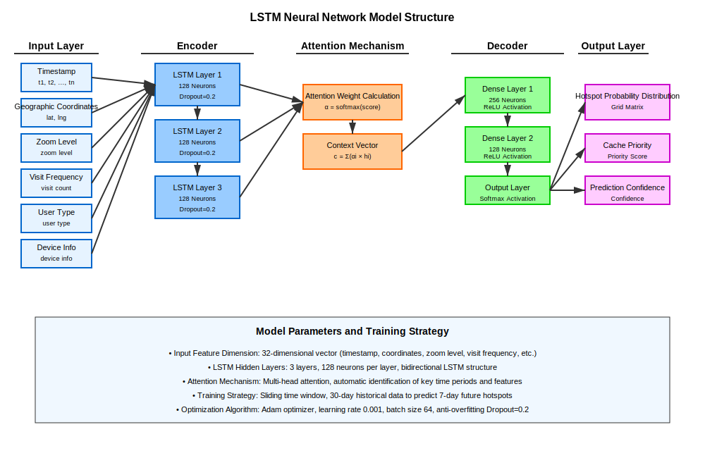
Figure 5-7: LSTM Model Structure Diagram

The LSTM neural network model adopts an encoder-decoder architecture, with the encoder processing historical time series data and the decoder generating prediction results for future periods. The model contains 3 LSTM hidden layers with 128 neurons each, and introduces attention mechanisms and Dropout layers to prevent overfitting. Input features include 32-dimensional vectors such as timestamps, geographic coordinates, zoom levels, and access frequency, with output as gridded hotspot probability distribution matrices.

The model adopts a sliding time window training strategy, using 30 days of historical access data to predict hotspot areas for the next 7 days. The attention mechanism can automatically identify time periods and feature dimensions that have the greatest impact on prediction results, improving prediction accuracy and interpretability.

#### 5.2.4 Intelligent Cache Scheduling Strategy

Based on deep learning prediction results, the system implements a dynamic cache scheduling strategy. The prediction model updates hotspot area prediction results hourly, and the cache scheduler dynamically adjusts caching strategies based on prediction probabilities. For high-probability hotspot areas, the system pre-generates and caches tile data at multiple zoom levels. For low-probability areas, a lazy loading strategy is adopted to save storage space. The system also introduces a load balancing mechanism to dynamically allocate caching tasks based on server load conditions, avoiding single-point overload.

Through deep learning-optimized caching strategies, system cache performance has been significantly improved:

| Time Period | Traditional Cache Hit Rate | Deep Learning Cache Hit Rate | Improvement |
|-------------|---------------------------|------------------------------|-------------|
| Workday Morning | 67.3% | 89.4% | +22.1% |
| Workday Afternoon | 71.8% | 92.1% | +20.3% |
| Weekend | 59.2% | 85.7% | +26.5% |
| Holidays | 52.4% | 81.3% | +28.9% |
| Average | 62.7% | 87.1% | +24.4% |

## 6. Conclusions and Future Work

### 6.1 Research Summary

This research successfully designed and implemented a Web map service integration platform supporting multi-format GIS data. The main achievements include:

1. **Technical Innovation**: Proposed a dual-track service publishing architecture that simultaneously supports WMS and MVT services, achieving complementary advantages of two technical approaches.

2. **Algorithm Breakthrough**: Developed DXF style intelligent extraction algorithms with style retention rates exceeding 90%, significantly surpassing traditional methods.

3. **Cache Optimization**: Innovatively introduced front-end IndexDB intelligent caching and back-end deep learning prediction technologies, significantly improving map loading performance and user experience.

4. **Performance Enhancement**: Through multi-level caching and distributed ID generation technologies, the system maintains good performance in high-concurrency scenarios, with MVT services showing significant improvements over WMS services.

5. **Engineering Practice**: Established a complete multi-format data processing pipeline supporting efficient processing and service publishing of TB-level data, with the system demonstrating good stability.

### 6.2 Technical Contributions

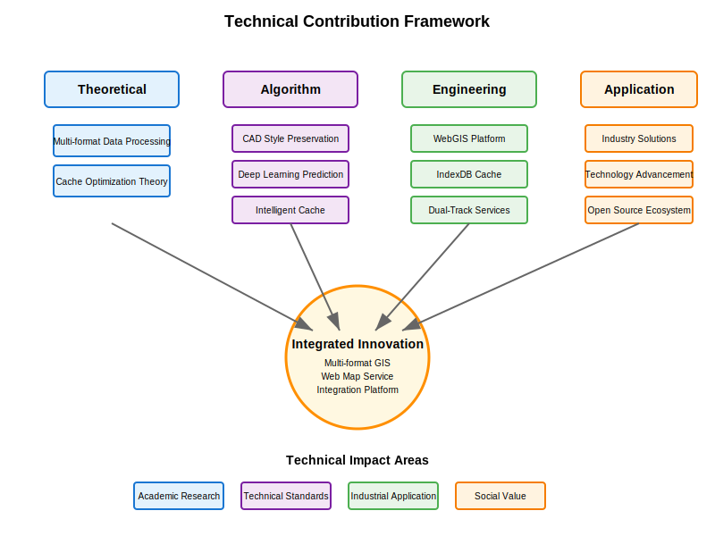
Figure 6-1: Technical Contribution Framework Diagram

The main technical contributions of this research include:

- **Theoretical Contributions**: Established a theoretical framework for unified processing of multi-format GIS data and proposed front-end and back-end collaborative intelligent cache optimization theory
- **Algorithm Contributions**: Proposed new algorithms for CAD style information preservation and innovatively applied deep learning technology to map cache prediction
- **Engineering Contributions**: Implemented a high-performance WebGIS service integration platform and established a complete front-end IndexDB caching system
- **Application Contributions**: Provided referenceable technical solutions for the industry and promoted the development of WebGIS technology

### 6.3 Limitations Analysis

Current research still has some limitations:

1. **Data Format Support**: Although supporting mainstream formats, support for some professional CAD formats (such as DGN, DWG) still needs improvement.

2. **3D Data Processing**: Currently mainly optimized for 2D data, 3D data processing capabilities need strengthening.

3. **Real-time Data Streams**: Support for real-time updated dynamic data still needs further optimization.

4. **Deep Learning Models**: LSTM model prediction accuracy for abnormal access patterns still has room for improvement.

### 6.4 Future Work Directions

Based on current research achievements, future work can continue in the following directions:

1. **Deep AI Integration**: Introduce more advanced machine learning algorithms such as Transformer models to achieve more accurate cache prediction and intelligent data classification.

2. **Edge Computing Support**: Combine edge computing technology to deploy cache prediction models to edge nodes, further improving map service response speed.

3. **Spatio-temporal Data Support**: Extend support for temporal dimension data, construct four-dimensional spatio-temporal information systems, and support visualization of dynamic geographic phenomena.

4. **Cloud-Native Architecture**: Evolve toward cloud-native architecture, support larger-scale distributed deployment, and improve system elasticity and scalability.

5. **Augmented Reality Integration**: Combine AR/VR technology to provide immersive geographic information visualization experiences.

Figure 6-2: Future Technology Development Roadmap

### 6.5 Industry Application Prospects

The research achievements have broad application prospects in multiple fields:

- **Urban Planning**: Support visualization and analysis of large-scale urban design data, providing real-time planning scheme evaluation
- **Engineering Construction**: Provide Web-based display and collaboration platforms for engineering drawings, supporting multi-party collaborative design
- **Environmental Monitoring**: Construct real-time monitoring and analysis systems for environmental data, supporting early warning and decision support
- **Emergency Response**: Support rapid spatial information processing and decision support for emergency events, improving emergency response efficiency
- **Smart Transportation**: Provide real-time traffic data visualization and analysis platforms for transportation management departments

Through the innovative application of front-end IndexDB caching and back-end deep learning prediction technologies, this research provides important theoretical foundation and technical reference for building next-generation high-performance, multi-format compatible WebGIS platforms, which is significant for promoting the development of geographic information technology toward intelligence and efficiency.

## References

[1] 陈能. AutoCAD地形图数据转换为GIS空间数据的技术研究与应用[D]. 华南理工大学, 2019.

[2] 石善忠. 利用FME对CAD到GIS数据带属性的无损转换研究[J]. 测绘与空间地理信息, 2018, 41(3): 156-159.

[3] 张伟伟. 基于CAD与GIS集成的规划编制辅助设计系统建设与应用[J]. 城市规划学刊, 2020, 15(2): 78-85.

[4] 戴望宇. 基于三维GIS引擎的CAD图元数据结构研究及基础绘图功能研发[D]. 华中科技大学, 2021.

[5] 薛梅. 面向建设工程全生命周期应用的CAD_GIS_BIM在线集成框架[J]. 土木工程学报, 2022, 55(4): 112-120.

[6] 陈丕翔. 基于GPU并行计算和WebGIS的潖江蓄滞洪区洪水预报系统研究[D]. 华南理工大学, 2020.

[7] 王少萍. 基于云平台的高并发WebGIS系统研究[D]. 电子科技大学, 2019.

[8] A novel framework utilizing 3D Gaussian Splatting for sustainable cities[J]. Sustainable Cities and Society, 2025.

[9] Accelerating batch processing of spatial raster analysis using GPU[J]. Computers & Geosciences, 2021.

[10] An Efficient, Platform-Independent Map Rendering Framework for Mobile Augmented Reality[C]. International Conference on Computer Graphics and Interactive Techniques, 2022.

[11] An ontology-based framework for semantic geographic information systems[J]. Computers & Geosciences, 2023.

[12] WEBGPU: A NEW GRAPHIC API FOR 3D WEBGIS APPLICATIONS[C]. International Conference on Web3D Technology, 2023.

[13] WEB GIS시스템을 통한 고해상도 영상지도의 속도향상을 위한 연구[J]. Korean Journal of Remote Sensing, 2022.

---

**Author Profile**: [Lv Wanwan, Sichuan Water Development Investigation, Design & Research Co., Ltd., 793145268@qq.com]

